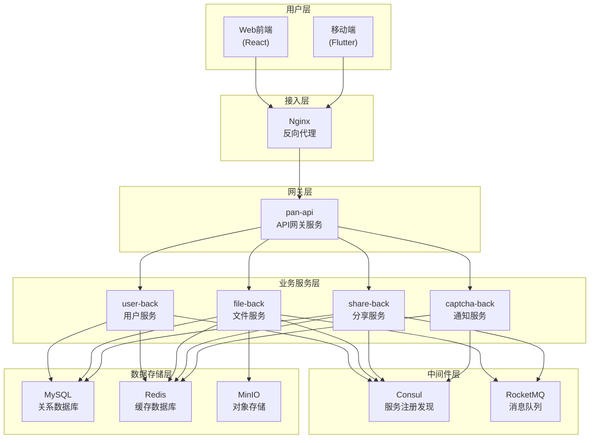

# 系统概述

## 产品介绍

仿百度网盘在线存储系统是一个基于Spring Boot + Spring Cloud + Dubbo微服务架构的企业级文件存储与分享平台。系统提供完整的用户管理、文件存储、分享协作等功能，支持大文件分片上传下载、文件秒传去重、安全的文件分享机制等核心特性。

## 核心功能特性

✅ 微服务架构 - 服务拆分清晰，职责单一，支持独立部署和扩展 \
✅ 分布式存储 - 基于MinIO的海量文件存储，支持PB级数据 \
✅ 智能上传 - 文件分片上传、断点续传、秒传机制 \
✅ 安全可靠 - JWT双Token认证、多重验证、数据加密 \
✅ 高性能 - 多级缓存、异步处理、负载均衡 \
✅ 可观测 - 全链路监控、日志追踪、性能分析 

## 整体架构图

## 核心功能模块（正在实现中，先画饼）
用户管理模块
- [ ] 邮箱验证码注册
- [ ] 多种方式登录（账号密码/邮箱验证码）
- [ ] 图形验证码人机校验
- [ ] 密码找回功能
- [ ] JWT双Token鉴权机制
- [ ] 用户信息管理
  
文件管理模块
- [ ] 文件/文件夹上传下载
- [ ] 大文件分片上传（支持GB级文件）
- [ ] 文件秒传（基于MD5去重）
- [ ] 断点续传下载
- [ ] 文件预览功能
- [ ] 批量文件操作
  
文件分享模块
- [ ] 文件/文件夹分享
- [ ] 分享链接密码保护
- [ ] 分享过期时间控制
- [ ] 文件转存功能
- [ ] 分享访问统计
  
通知服务模块
- [ ] 邮件验证码发送
- [ ] 邮件模板管理
- [ ] 验证码生成和验证
- [ ] 消息队列处理
- [ ] 异步邮件发送

